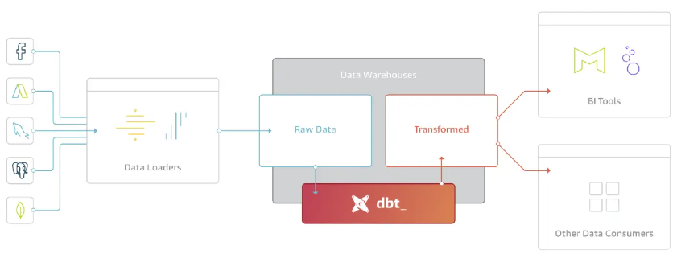

# hello-dbt

Made from following [Quickstart for dbt Core from a manual install](https://docs.getdbt.com/guides/manual-install)

## What is dbt?



> dbt is the T in ELT. It doesn't extract or load data, but it's extremely good at transforming data that's already loaded into your warehouse. This "transform after load" architecture is becoming known as ELT (extract, load, transform).

Source: <https://www.getdbt.com/blog/what-exactly-is-dbt>


## dbt and APIs

What if you want to [call any external REST API inside DBT(Data Build Tool)?](https://stackoverflow.com/questions/66224513/can-we-call-any-external-rest-api-inside-dbtdata-build-tool)

As the previous section explained, dbt does not help you. There are, however, different tools for that, e.g. [Apache Airflow](https://airflow.apache.org/)

## How this project was setup

In order to not have to install dbt and adapters into your system, you can create a small python project and virtual environment using uv:

```bash
uv add dbt-core dbt-bigquery
uv run dbt init jaffle_shop
```

## Prerequisites

You have to set up a GCP project, create a BigQuery dataset and generate BigQuery credentials as described in [steps 1-4 in the Quickstart for dbt and BigQuery](https://docs.getdbt.com/guides/bigquery).

## How to install and run this project

dbt and the BigQuery adapter is installed using uv. To run the project do the following:

```bash
uv sync
cd jaffle_shop
uv run dbt run
uv run dbt test
```
